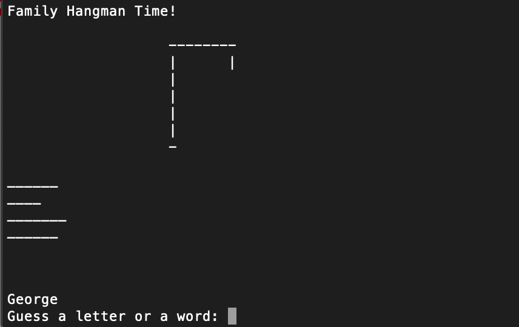

# Make my own Hangman

TL;DR: Play hangman from command line interface. But unlike normal hangman where you guess a single generic word ('doorbell'), you are able to:
- assign players to specific answers 
- create custom answers and hints
- create custom messaging

During the COVID-19 crisis, my family started having weekly video conferencing calls where we'd talk about Netflix shows and current events.

After the second week, we ran out of stuff to talk about, so we started doing trivia. This has been super fun, but I thought it'd be funner (this is now a word, pedants) to make a simple computer game to structure our play.

(Also because people had a hard time with my political trivia, so I figured letter-guessing would be less embarassing for all involved. But seriously, no one remembers Tip O'Neill?!)

Steps to make this work:
- Get these files onto your computer (clone/fork the repo, copy/paste the code, anything to get it onto your machine)
- Replace players/answers/themes/hints in `custom_words.py` with players/answers/themes/hints relevant for your people
- Navigate to the folder with these files via command line (for Mac users, open Terminal and cd into the folder that contains these files)
- Type the following, then play the game from command line: `python hangman.py`

The fun to be had is a function of how well you make your answers, themes, and clues. For good gameplay, you should consider the statistical character of your answers (strings with few unique characters and with uncommon characters are harder to guess, for example).

Rather than enumerate an incomplete list of principles of good answers, let me provide some examples:
- "Deutsch Lietuviu Italiana English" —> assigned to my uncle, about languages my grandma fluently speaks.
- "accordian guitar piano" —> assigned to my cousin (who's into music), about musical instruments played by her mom/aunt/uncle, and the clue is "Exactly 2/3 of these are cool."
- "Tippy Chloe Max Bowie Mugsy Tilly Chance Elvis Layla Ace" —> clue for my grandma about the dogs we've had in the family. Notice, since there are so many letters, it will be harder to exhaust all six tries (basically guaranteed to win).

If you have suggestions for added functionality or improvement in general, please share!

My family thoroughly enjoyed the game, but I must reiterate that the 'funness' is proportional to the goodness of your answers, themes, and clues. You will impress no one with the graphics.
